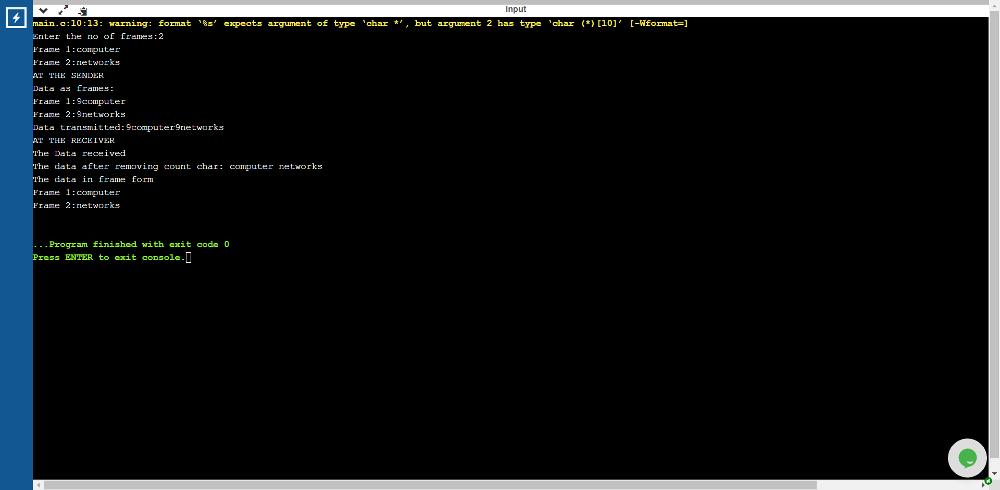

#EXPERIMENT1-(Character count)

#Aim of the Experiment
to implement data link layer framming method character count

### step step procedure of experiment
1.scanning the number of frames and their data
2.counting the number of characters in each count

3.printing the character count and the character
4.printing the character without count
5.printing the data in frame form

##output

